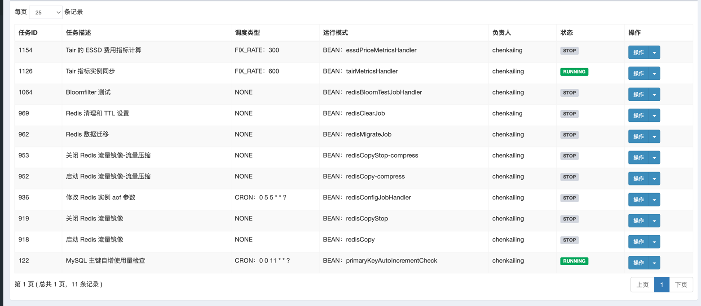

# redis-tools
redis-tools 是一个 Redis 成本优化工程沉淀的工具集，包含了 Redis 的常用操作，比如 Redis 流量复制回放、Redis 数据在线压缩解压缩、Redis 数据清理TTL设置等工具集。

> 项目基于 spring-boot 开发，通过 Apollo 实现配置动态更新下发，将每个工具功能封装为一个 job ，然后通过 XXL-JOB 实现任务调度运行.

> 请确保了解清楚每个 job 的逻辑，再进行使用，避免误操作导致数据丢失等问题。
## 工具集

### Redis 流量复制回放
基于 Redis 的 Monitor 命令，实现 Redis 流量复制回放,方便做各种流量放大性能验证。该工具实现了如下功能：

1. 支持只复制原实例指令输出到控制台，或复制流量回放到指定目标实例
2. 支持只复制读流量、只复制写流量、读写流量一起复制
3. 支持流量等比放大回放
4. 支持原实例是集群模式时（集群模式 mget 订阅到的是单 key，不符合真实业务 mget），指定 mget keys 大小发送到目标实例，且支持比例设置，比如
   10% mget 的 keys=100, 40% mget 的 keys=30

### Redis 数据在线压缩&解压缩

这个工具主要用在【压缩 value】项目中，用于验证不同的压缩算法的压缩性能、解压缩性能、压缩率等。实现了如下功能：

1. 支持指定压缩算法 gzip、zstd，进行压缩性能、解压缩性能、压缩率等的计算
2. 支持复制线上流量进行压缩或解压缩
3. 支持跑存量的数据进行压缩或解压缩

### Redis 数据定向清理&定向指定TTL

这个工具主要用于【清理历史数据】、【合理设置TTL】等项目，主要实现了如下功能：

1. 支持指定 key 前缀删除数据
2. 支持指定 key 前缀设置 TTL
3. 支持 dryrun 模式，只输出操作的日志，实际上不进行删除或TTL设置。
4. 支持指定 key 的 MaxIdleTime 进行删除或TTL设置

### Redis扫描分析Key最后访问时间

这个工具主要用于【清理历史数据】、【合理设置TTL】等项目，主要实现了如下功能：

1. 支持扫描所有的 key ，打印 idelTime ,通过统计分析得到 key 的访问时间分布

### Redis 磁盘型实例指标采集

通过阿里云的 OpenAPI ，采集获取到 Redis ESSD（Tair） 实例列表，然后通过 info 指令拿到实例运行时关键信息，通过解析 info
拿到关键指标，实现了：

1. 指令级的 QPS 、RT 、带宽等数据观测
2. RocksDB 底层的 Compactions、Flush 等事件数据观测

